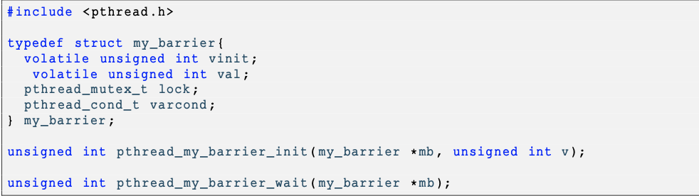

<h1>Esercitazione sul problema dei filosofi a cena e sull'uso delle barriere. </h1>

**1) Problema dei filosofia cena**

Il problema  della cena dei filosofi è un classico problema di condivisione delle risorse nella programmazione concorrente. Questo problema è riassunto come segue. Ci sono n filosofiseduti attorno a un tavolo. Ogni filosofo ha davanti a sé un piatto di riso e per mangiare ha bisogno di due bacchette. Ci sono un totale di n bacchette situate a sinistra di ciascun piatto. Un filosofo si comporta in questo modo: pensa, poi se vuole mangiare, prende la bacchetta sinistra, poi prende la bacchetta destra e quando finisce di mangiare restituisce le due bacchette e ricomincia a pensare, e così via. In questo esercizio desideriamo modellare il problema della cena dei filosofi con un programma C in cui ogni bacchetta sarà rappresentata da un lock e ogni filosofo sarà implementato da un thread.

1. Proponete un implementazione della cena dei filosofi con 5 filosofi. In questa implementazione, ciascun filosofo dovrà dire (stampando sul terminal) il suo stato, ad esempio ’Filosofo 1: sta pensando’, ’Filosofo 1: ha la sua bacchetta sinistra’, ’Filosofo 1: ha la sua bacchetta destra’, ’Filosofo 1: sta mangiando’, ’Filosofo 1: ha rilasciato le sue due bacchette’. Per essere sicuro che il vostra programma finisce, potete supporre che ogni filosofo vorrà mangiare 5 volte.

<i>**Consegna:** Scriverete questa implementazione in un file philo.c.</i>

2. Se avete rispettato le indicazione, la vostra implementazione dovrebbe produrre un deadlock dei filosofi. Provate ad esibirlo (usando per esempio dei sleep nel vostro codice).
3. Proponete una modificazione della vostra implementazione nel modo di evitare il deadlock.

<i>**Consegna:** Scriverete questa nuova implementazione in un file philo2.c.</i>

**2) Barriera**

Lo scopo di questo esercizio è di farvi implementare una barriera in C. Scrivete in un header file my\_barrier.h la struttura di dati e le prototipe come indicato sotto:

Vi chiediamo di implementare in un file barrier.c le due funzione pthread\_my\_barrier\_init e pthread\_my\_barrier\_wait e di testarli in un main.

Vi ricordiamo che la barriera blocca i thread che chiamano wait, finche vinit threads hanno fatto questa chiamata, a questo punto la barriera sveglia tutti gli thread in attesa e torna nel suo stato iniziale ad aspettare vinit threads. La funzione pthread\_my\_barrier\_init serve a inizializzare la barriera mettendo il valore v dentro vinit (il valore val della barriera serve a contarre il numero di threads che ha fatto wait fino ad ora). Per questa ultima funziona, se v è uguale a 0, la funzione deve ritornare -1.Ciascun di queste due funzione ritorna 0, se tutto è andato a buon fine,
